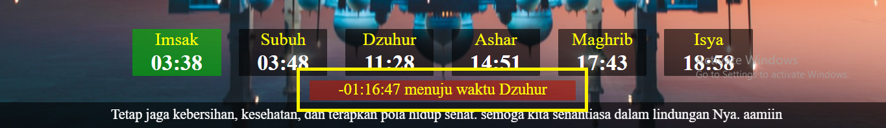
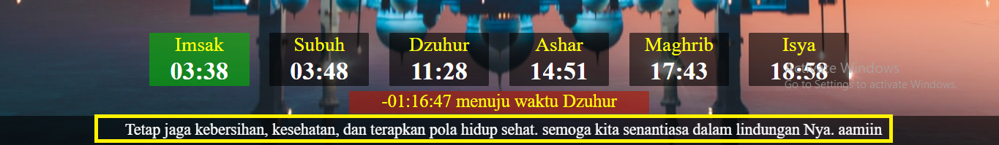
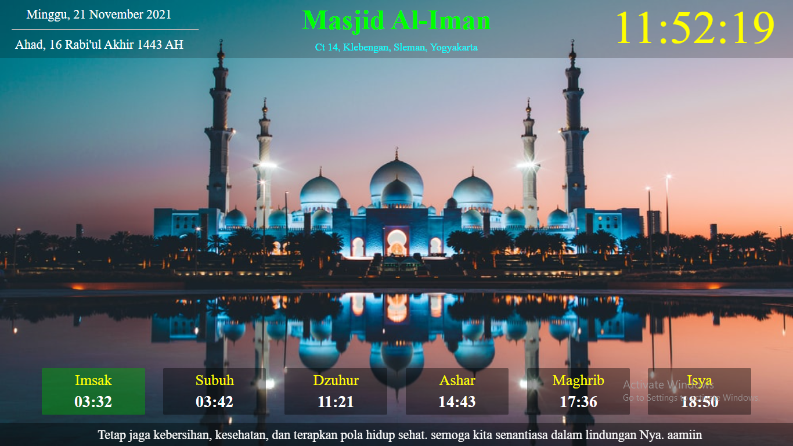

# iMasjid
Informasi Masjid

### Header
- head-type-1

- head-type-2

- head-type-3

### Content
- content-type-1

- content-type-2

- content-type-3

- content-type-4

- #### Pengingat

  
  
### Footer
- #### Marquee Informasi

  

## Preview

> ## **Semoga bermanfaat bagi kita semua. Aamiin**
